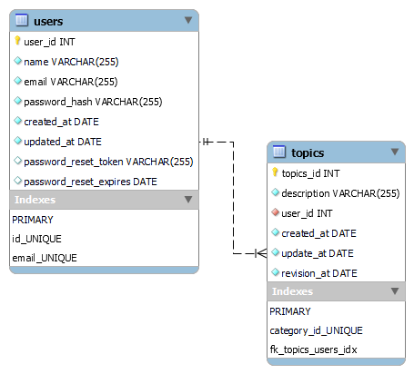

# PROJETO FINAL ESPECIALIZAÇÃO TRAINEE COMP

## Descrição
Desenvolvimento de uma api para permitir controle de revisão de estudos de um usuário.
Assim esse usuário poderá inserir tópicos estudados e um prazo que ele pretende revisar esse tópico.
Dessa maneira, cada usuário poderá montar um cronograma para si mesmo.
A princípio a ideia é que aplicação possua duas entidades: Tópico a ser revisado e o usuário. Assim o usuário se cadastra na aplicação e após cadastro fará login e conseguirá adicionar tópicos e o prazo em dias de quando se deseja revisar.  Dessa forma, poderá acompanhar as materias que a revisão está atrasada e atualizar os prazos para novas revisões.
Dessa maneira, cada usuário terá seu próprio historico de revisões.

Caso o usuário esqueça a senha será permitido ele solicitar a redefinição da mesma sendo enviado para ele um token que deve ser passado na solicitação de redefinição

### Modelo Diagrama ER



## Rotas
O teste de rotas pode ser feito utilizando a ferramenta Postman ou Insomnia, na pasta collections possui um arquivo `EspecializacaoBack.postman_collection.json` que pode ser importado com todas as rotas disponivéis para realizar.
Abaixo está uma descrição das rotas e das ações executadas por cada uma.

### Rotas apenas de teste
| Método  | Caminho da rota    | Ação
|---------| -------------------|--------------
| GET    	| /verify            | Veririca se o servidor está respondendo
| GET     | /auth/verify       | Veririca resposta do usuário com se ele estiver logado

### Rotas de Autenticação
| Método    | Caminho da rota        | Ação
|-----------|------------------------|--------------
| POST      | /auth                  | Autenticação do usuário
| POST	    | /auth/forgot-password  | Envia token para o email do usuário
| POST      | /auth/reset-password   | Reseta a senha do usuário

### Rotas para Users 
| Método  | Caminho da rota    | Ação
|---------| -------------------|--------------
| POST   	| /user              |	Adiciona usuário
| PUT	    | /user	             | Atualiza usuário
| DELETE  | /user	             | Deleta usuário
| GET	    | /user              | Obtém informações do usuário


### Rotas para Topics
| Método  | Caminho da rota    | Ação
|---------| -------------------|--------------
| PUT	    |/topic/:id          | Atualiza tópico
| DELETE	|/topic/:id          | Deleta tópico
| GET	    |/my-topics	         | Lista todos os tópicos do usuário
| GET	    |/topic/delayed	     | Lista apenas tópicos de hoje e atrasados
| GET     |/all-topics         | Lista todos os tópicos presentes na tabela com o usuário pertencente

## Índice

- [PROJETO FINAL ESPECIALIZAÇÃO TRAINEE COMP](#projeto-final-especialização-trainee-comp)
  - [Descrição](#descrição)
    - [Modelo Diagrama ER](#modelo-diagrama-er)
  - [Rotas](#rotas)
    - [Rotas apenas de teste](#rotas-apenas-de-teste)
    - [Rotas de Autenticação](#rotas-de-autenticação)
    - [Rotas para Users](#rotas-para-users)
    - [Rotas para Topics](#rotas-para-topics)
  - [Índice](#índice)
  - [Tecnologias Usadas](#tecnologias-usadas)
  - [Instalação](#instalação)
    - [Pré-requisitos](#pré-requisitos)
    - [Configuração](#configuração)
  - [Como Usar](#como-usar)
  - [Equipe](#equipe)
  - [Feedback e Contato](#feedback-e-contato)
  - [Licença](#licença)

## Tecnologias Usadas

Liste as tecnologias, frameworks e bibliotecas utilizadas no projeto. Exemplo:
- Node.js
- Express

- Sequelize
Utilizado para facilitar a integração dos modelos das tabelas a serem utilizadas no banco de dados
- MySql
Usado para armazenar os dados 
- bcryptjs
Utilizado para permitir encriptar o password e o token utilizado 
- Jsonschema
Utilizado para faciliar a verificação dos dados que devem ser inseridos nas requisiçÕes
- Jsonwebtoken
Utilizado par poder gerar um token de autenticação do usuário
- NodeMailer
Utilizado para realizar o envio de emails
- NodeMailer-Express-handlebars
Utilizado para poder enviar um email com um template de email, sendo possível trabalhar com variaveis para construção

## Instalação
- Configure as informações presentes no arquivo .env.txt em um arquivo .env na raiz do projeto e atualize as informações
- Verifique as configurações do arquivo db.js a serem passadas ao sequelize
- Execute os comandos
 ```bash
npm install
```
```bash
npx sequelize db:migrate
``` 


### Pré-requisitos

Antes de começar, verifique se atendeu aos seguintes requisitos:
- Versão mais recente de `node.js`
- Configuração correta do Banco de Dados
- Para teste das requisições deve se intalar o programa Postman ou Insomnia

### Configuração
- Deve se verificar as informações no arquivo `.env` e adequala-las conforme o banco de dados utlizado


## Como Usar
Após a instalação e configuração do banco de dados, para utilizar o projeto deve se iniciar o servidor

```bash
npm start
```

Assim para poder verificar o funcionamento do sistema deve se garantir que os dados do banco de dados tenham sido passadas corretamente no arquivo `.env` como já mencionado. 
Então deve se iniciar o aplicativo Postman ou Insmonia e testar as requisicoes já importadas.

## Equipe

- [@WillianBrandao](https://github.com/WillianBrandao) - Ideia & Desenvolvimento inicial, documentação e manutenção

## Feedback e Contato

Para enviar feedback ou entrar em contato, por favor, envie um e-mail para `willian.souza@compjunior.com`.

## Licença

Este projeto está licenciado sob a Licença ISC